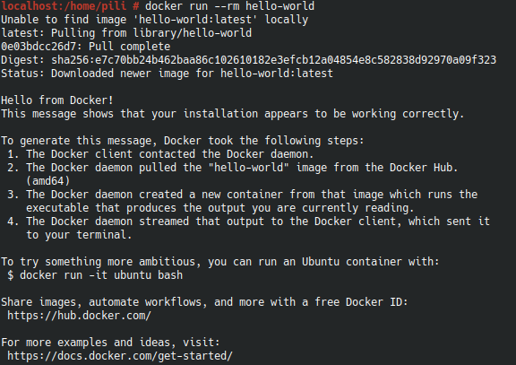
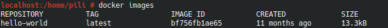
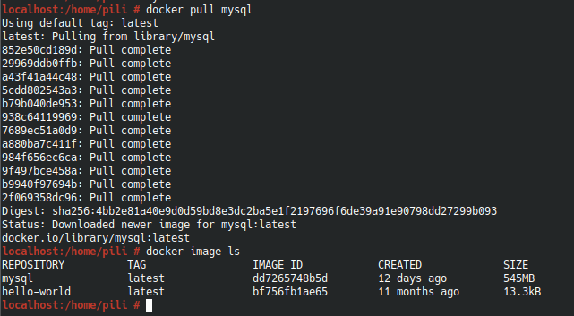

# INSTALACIÓN DE DOCKER Y MYSQL

## Docker
En mi caso voy a instalar docker desde un OpenSuse, ya que para Linux no hay una versión Desktop lo instalaremos en consola.

### PASOS A SEGUIR:

Usarmos zypper para descargar el repositorio:
```
zypper instalar docker python3-docker-compose
```
Iniciamos el demonio docker durante el arranque:
```
systemctl enable docker
```
Nos unimos al grupo de la ventana acopable que puede usar el demonio de la ventana acoplable:
```
usermod -G docker -a $ USER
```
Reiniciamos el docker
```
systemctl restart docker
```
PARA LA COMPROBACIÓN:

Nos instalamos una imagen de ejemplo: 
```
docker run --rm hello-world
```
;

Y seguidamente limpiamos y eliminamos la imagen para no acumular
```
docker rmi -f IMAGE_ID
```
(Dentro de "IMAGE_ID ponemos el nombre de la imagen, en este caso hello-world")

Dentro de docker tendriamos estas imágenes: 

;

## CREACIÓN DE UNA IMÁGEN MYSQL

Descargamos la última imágen de MySQL:
```
docker image ls
```
;

Creamos el contenedor de mysql:
```
docker run -d --name mysql-latest -e MYSQL_ROOT_PASSWORD=root -v /home/pili/.conf:/var/lib/mysql -p 3306:3306 mysql
```

- -d : Para lanzarlo de segundo plano

- -- name : Asignamos un nombre al contenedor

- -e : Utilizamos ese comando para utililzar una de esas variables y decirle a la imagen que queremos una password personalizada

- -v : Comando que nos sirve para indicar que el contenido de una carpeta del contenedor este montada en una de la maquina

- p : Comando que sirve para enlazar los puertos del contenedor con los de la maquina real

- Y por ultimo donde pone mysql es la imagen que se utilizara para la creacion del contenedor.
