# Docker
En mi caso voy a instalar docker desde un OpenSuse, ya que para Linux no hay una versión Desktop lo instalaremos en consola.

## PASOS A SEGUIR:

Usarmos zypper para descargar el repositorio:
```
zypper instalar docker python3-docker-compose
```
Iniciamos el demonio docker durante el arranque:
```
systemctl enable docker
```
Nos unimos al grupo de la ventana acopable que puede usar el demonio de la ventana acoplable:
```
usermod -G docker -a $ USER
```
Reiniciamos el docker
```
systemctl restart docker
```
## Para la comprobación:

Nos instalamos una imagen de ejemplo: 
```
docker run --rm hello-world
```


Y seguidamente limpiamos y eliminamos la imagen para no acumular
```
docker rmi -f IMAGE_ID
```
(Dentro de "IMAGE_ID ponemos el nombre de la imagen, en este caso hello-world")

Dentro de docker tendriamos estas imágenes: 


# CREACIÓN DE UNA IMÁGEN MYSQL

Descargamos la última imágen de MySQL:
```
docker image ls
```


Creamos el contenedor de mysql:
```
docker run -d --name mysql-latest -e MYSQL_ROOT_PASSWORD=root -v /home/pili/.conf:/var/lib/mysql -p 3306:3306 mysql
```

- **-d** : Para lanzarlo de segundo plano

- **--name** : Asignamos un nombre al contenedor

- **-e** : Utilizamos ese comando para utililzar una de esas variables y decirle a la imagen que queremos una password personalizada

- **-v** : Comando que nos sirve para indicar que el contenido de una carpeta del contenedor este montada en una de la maquina

- **-p** : Comando que sirve para enlazar los puertos del contenedor con los de la maquina real

- Y por ultimo donde pone mysql es la imagen que se utilizara para la creacion del contenedor.

Una vez iniciada mysql comprobamos que está funcionando

```
docker stats
```
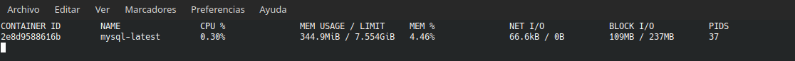

# INSTALACIÓN MYSQL WORKBENCH

En mi caso para la instalación al ser un OpenSuse hay que descargarse un archivo .ymp que te lo instala con Yast. 

```
<metapackage xmlns:os="http://opensuse.org/Standards/One_Click_Install" xmlns="http://opensuse.org/Standards/One_Click_Install">
  <group distversion="openSUSE Leap 15.2">
    <repositories>
      <repository recommended="true">
        <name>openSUSE:Leap:15.2</name>
        <summary>openSUSE Leap 15.2</summary>
        <description>openSUSE Leap borrows packages from SLE for the base system. Please refer to https://osrt.opensuse.org/web/origin-manager/#openSUSE:Leap:15.2 for origin information</description>
        <url>http://download.opensuse.org/distribution/leap/15.2/repo/oss/</url>
      </repository>
    </repositories>
    <software>
      <item>
        <name>mysql-workbench</name>
        <summary>A MySQL visual database modeling, administration and querying tool</summary>
        <description>MySQL Workbench is a modeling tool that allows you to design
and generate MySQL databases graphically. It also has administration
and query development modules where you can manage MySQL server instances
and execute SQL queries.
This is the community build.</description>
      </item>
    </software>
  </group>
</metapackage>

```
- Archivo usado para instalar MySQL Workbench

> OJO!! El MySQL Workbench no funciona con MYSQL (OpenSuse por lo menos) por lo que he pasado a usar el MariaDB

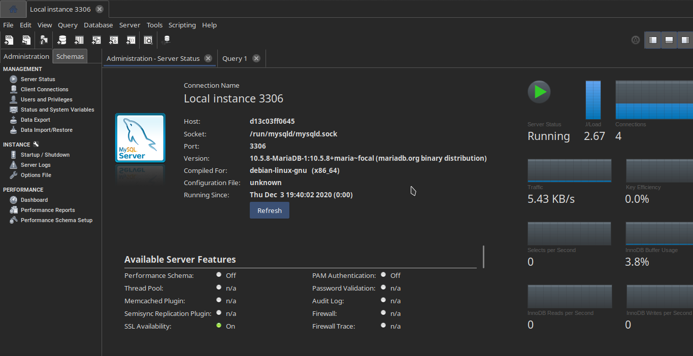

En ella las bases de datos:

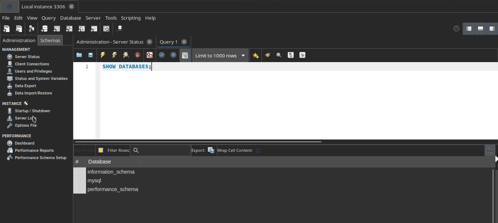

- Creamos 2 nuevas bases de datos desde consola:

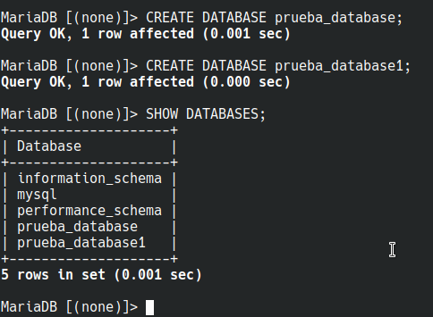

- Comprobamos desde el cliente Workbench:

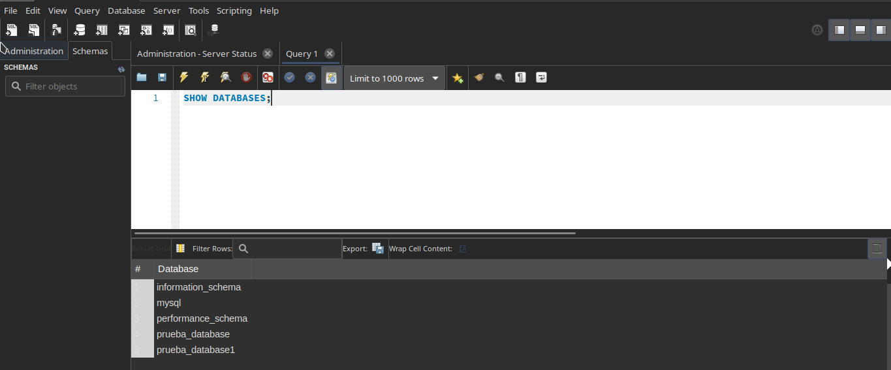


- Eliminamos una base de datos desde Workbench:

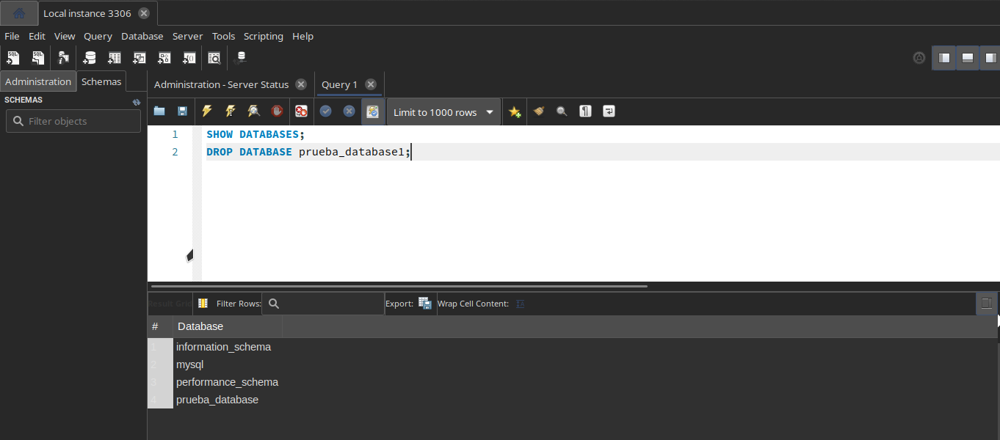

- Salimos de (en mi caso) MariaDB: exit

Para visualizar los contenedores que están activos se usa el comando:
```
docker ps
```
Para parar un contenedor:
```
docker stop ID_CONTENEDOR
```

Para ver los contenedores tanto abiertos como los parados:
```
docker ps -a
```

Dentro del Workbench podemos ver las tablas pero no podemos acceder a ellas. Además de que al crear las bases de datos no contienen tablas todavía. 

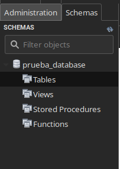

Comprobamos el estado de las carpetas en local

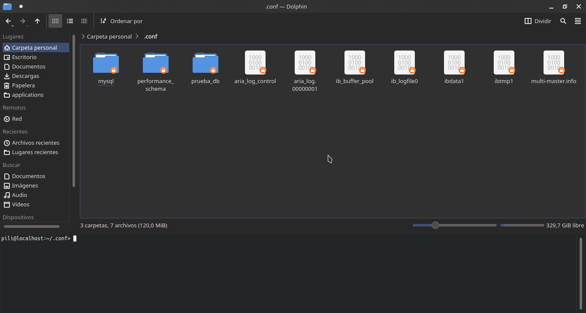

Eliminamos el contenedor y comprobamos que en las carpetas en local que sigue estándo: 

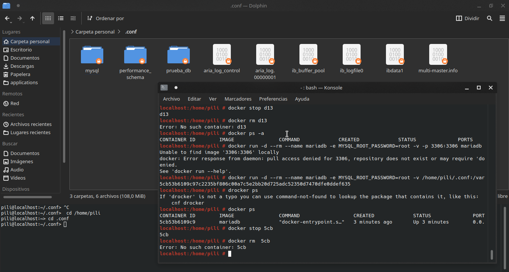
  
Comprobamos que al volver a meter el contenedor los datos no se han perdido:

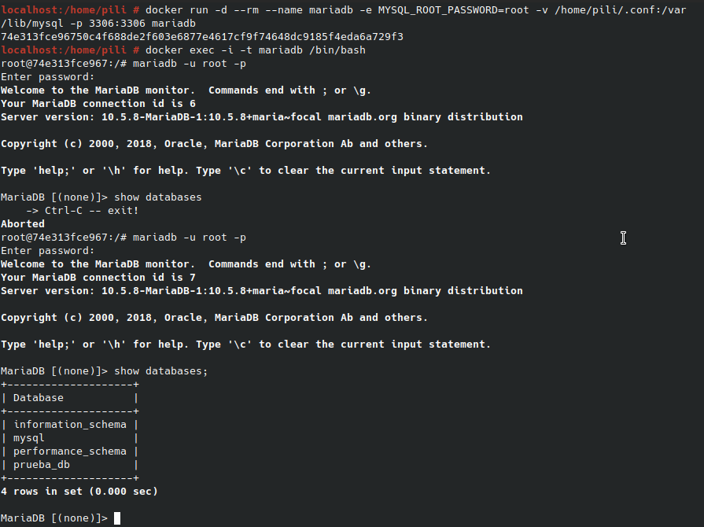

##------------------------------------------------------##

# INSTALACIÓN PHPMYADMIN EN DOCKER

Primero comando que usamos para esta instalación es: 
```
zypper in docker-compose
```
Guardamos archivo yml en una carpeta especifica para el compose que contendrá:

```
version: '3'
services:
    phpmyadmin:
        image: phpmyadmin/phpmyadmin
        environment:
            - PMA_HOST=mariadb-latest
        ports:
            - 80:80
        networks:
            - default-net
        depends_on: 
            - mariadb-latest
    mariadb-latest:
        image: mariadb
        environment:
            - MYSQL_ROOT_PASSWORD=root
        volumes:
            - /home/pili/.conf:/var/lib/mysql
        networks:
            - default-net
networks:
    default-net:
```
Y ejecutamos
```
docker-compose up -d
```
Comporbamos: 

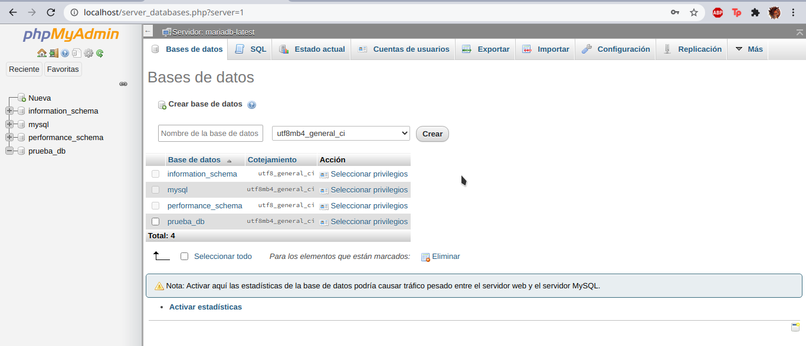